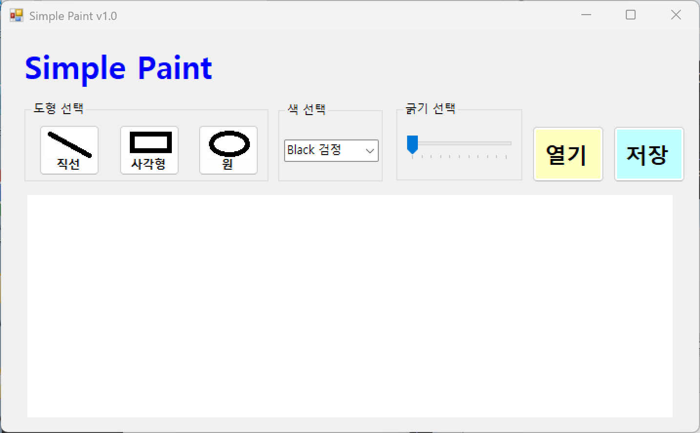
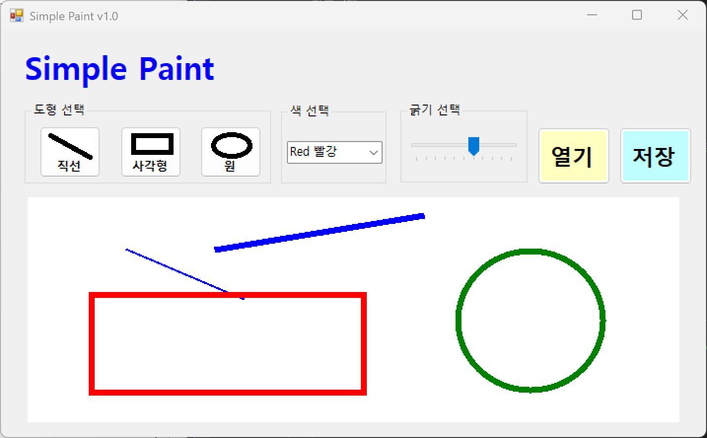
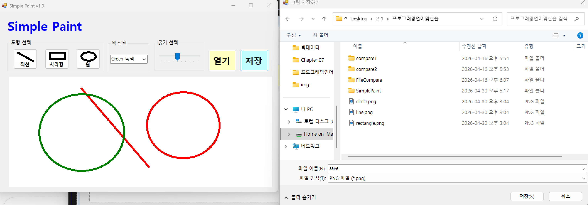
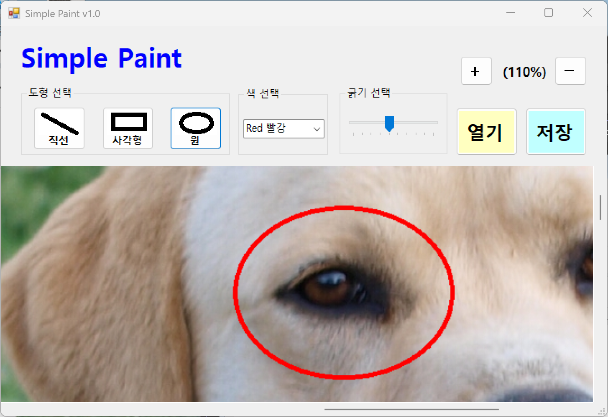

# (C# 코딩) Simple Paint

## 개요
- C# 프로그래밍 학습
- 1줄 소개 : 마우스로 그림을 그릴 수 있는 그림판 프로그램

- 사용한 플랫폼:
    - C#, .NET Windows Forms, Visual Studio, GitHub

- 사용한 컨트롤
    - Label, Button, ComboBox, TrackBar, PictureBox
   
- 사용한 기술과 구현한 기능
    - Visual Studio를 이용하여 UI 디자인
    - GDI+ Graphics 클래스를 이용한 직선, 사각형, 원 그리기 엔진 구현
    - Bitmap 객체를 활용하여 메모리 상에 이미지 버퍼를 생성하고 데이터 보존 처리
    - MouseEventArgs의 Location 정보를 활용한 드래그 앤 드롭 그리기 좌표 계산
    - Invalidate 메서드 호출을 통한 실시간 화면 갱신 및 Paint 이벤트 핸들링 기술
    - 배율(Zoom Factor) 변수를 적용한 픽처박스 크기 조절 및 해상도 대응 렌더링

## 실행 화면 (과제1)
- 코드의 실행 스크린샷과 구현 내용 설명

- 구현한 내용 (위 그림 참조)
    - UI 구성 : 도형선택, 색선택, 굵기선택, 캔버스 구성
    - 도형선택 : 버튼 3개를 이용해서 직선, 사각형, 원 선택
    - 색선택 : ComboBox를 이용해서 검은색, 빨간색, 파란색, 초록색 선택
    - 선굵기선택 : TrachBar 이용해서 선 굵기를 1~10단계로 선택
    - 캔버스 : PictureBox를 이용해서 캔버스 구성

## 실행 화면 (과제2)
- 코드의 실행 스크린샷과 구현 내용 설명

- 구현한 내용 (위 그림 참조)
    - 실시간 도형 드로잉 로직 구현 : `MouseDown`, `MouseMove`, `MouseUp` 이벤트를 조합하여 사용자의 드래그 동작에 반응하는 동적 그리기 시스템 구축
    - 도형 선택 핸들러 : `enum ToolType`과 `switch-case` 구문을 활용하여 사용자가 클릭한 버튼에 따라 직선, 사각형, 원 모드를 유연하게 전환하도록 처리
    - 동적 미리보기(Preview) 시스템 : 마우스 드래그 중에는 `Invalidate()`를 호출하여 `Paint` 이벤트를 발생시키고, `DashStyle.Dash`가 적용된 점선 펜을 사용하여 확정 전 도형의 형태를 실시간으로 피드백 제공
    - 좌표 보정 및 정규화 : 사각형과 원을 그릴 때 마우스의 드래그 방향(상하좌우)에 상관없이 정상적인 도형이 생성되도록 `Math.Min`과 `Math.Abs` 함수를 이용해 위치 좌표와 크기 값을 계산하는 로직 적용
    - 상태 기반 펜(Pen) 설정 : `ComboBox`에서 선택된 색상 상숫값과 `TrackBar`에서 설정된 정수형 굵기 데이터를 실시간으로 수집하여 `Pen` 객체에 동적으로 반영
    - 최종 드로잉 확정 : 마우스 버튼을 놓는 시점(`MouseUp`)에만 `Graphics.FromImage`를 통해 얻은 비트맵 객체에 실제 도형 데이터를 기록하여 메모리 기반 버퍼(canvasBitmap) 업데이트

## 실행 화면 (과제3)
- 코드의 실행 스크린샷과 구현 내용 설명

- 구현한 내용 (위 그림 참조)
    - 저장 대화상자 구현 : SaveFileDialog 컴포넌트를 사용하여 사용자로부터 저장 경로와 파일 이름을 입력받는 기능
    - 확장자 필터 설정 : Filter 속성을 이용해 PNG, JPG, BMP 형식을 지정하고 사용자가 선택한 FilterIndex에 따라 포맷 인코딩
    - 이미지 포맷 지원 : 무손실 압축인 PNG, 용량이 작은 JPG, 원본 화질인 BMP 포맷을 모두 지원하도록 Save 메서드 활용
    - 예외 처리 : 파일 저장 중 발생할 수 있는 오류를 try-catch 구문으로 처리하여 프로그램 안정성 확보 및 완료 메시지 표시

## 실행 화면 (과제4)
- 코드의 실행 스크린샷과 구현 내용 설명

- 구현한 내용 (위 그림 참조)
    - 외부 이미지 읽기 : OpenFileDialog와 Image.FromFile 메서드를 연동하여 외부 사진 파일을 캔버스로 로드하는 기능
    - 캔버스 동적 리사이징 : 불러온 이미지의 실제 가로, 세로 크기에 맞춰 canvasBitmap을 재생성하고 픽처박스 크기 강제 조정
    - 스크롤바 창 구현 : AutoScroll 속성이 활성화된 Panel 안에 픽처박스를 배치하여 큰 이미지 로드 시 자동으로 스크롤바 생성
    - 확대 및 축소 기능 : +/- 버튼 클릭 시 zoomFactor 변수 값을 조정하고 이에 맞춰 픽처박스의 Width와 Height를 연산하여 화면 표시
    - 좌표 보정 알고리즘 : 화면이 확대되거나 축소된 상태에서도 마우스 클릭 위치가 실제 비트맵 좌표에 대응되도록 (좌표 / 배율) 연산 적용
    - 통합 저장 시스템 : 불러온 배경 이미지와 그 위에 추가로 그린 도형 데이터가 하나로 합쳐진 최종 비트맵을 파일로 저장하는 기능